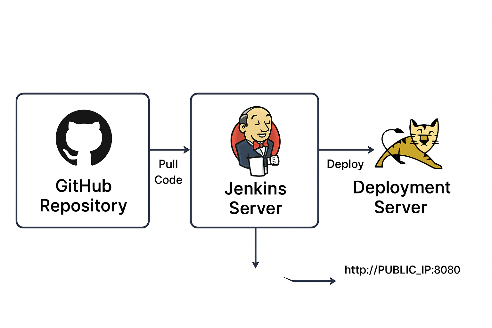
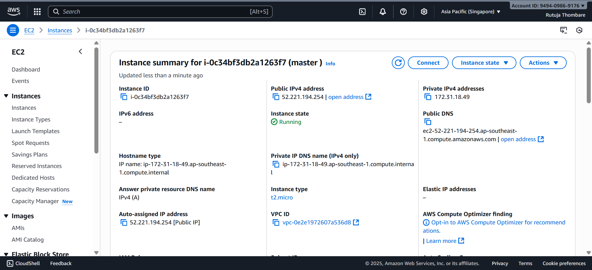
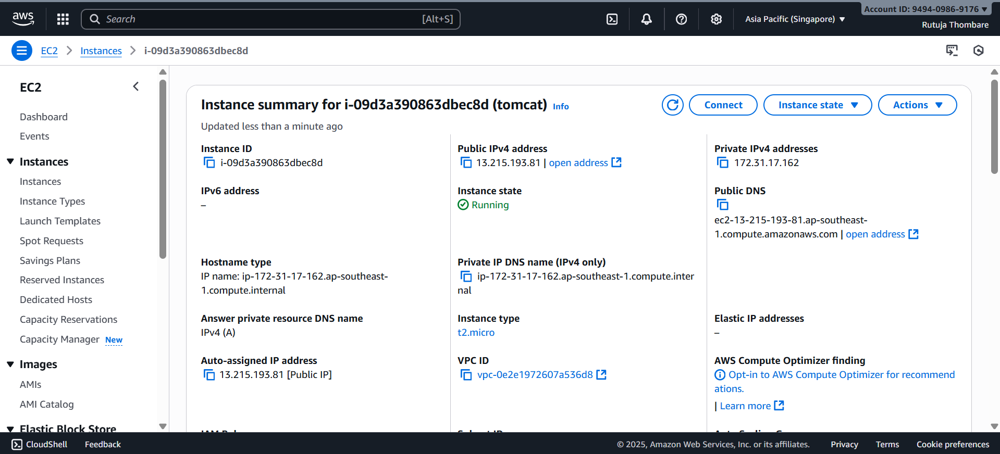

# Java Form Deployment using Jenkins, Maven, and Tomcat

This project demonstrates how to deploy a Java web application (form application) using a CI/CD pipeline with **Jenkins**, **Maven**, and **Tomcat**, hosted across two different servers.

---

## Architecture Overview

| Server | Purpose |
|-------|---------|
| **Jenkins Server** | Builds the project and automates deployment |
| **Deployment Server** | Runs the Java application using Tomcat |



---

## 1. Launch Two EC2 Servers

### Server 1: Jenkins Server
- Ubuntu 22.04
- Open ports: `22`, `8080`



### Server 2: Deployment Server (Tomcat Server)
- Ubuntu 22.04
- Open ports: `22`, `8080`



---

## 2. Configure Jenkins Server

### Connect via SSH
```
ssh -i key.pem ubuntu@JENKINS_SERVER_PUBLIC_IP
```

### Install Java
```
sudo apt update
sudo apt install openjdk-17-jdk -y
```

### Install Jenkins
```
curl -fsSL https://pkg.jenkins.io/debian-stable/jenkins.io.key | sudo tee   /usr/share/keyrings/jenkins-keyring.asc > /dev/null
echo deb [signed-by=/usr/share/keyrings/jenkins-keyring.asc]   https://pkg.jenkins.io/debian-stable binary/ | sudo tee   /etc/apt/sources.list.d/jenkins.list > /dev/null
sudo apt update
sudo apt install jenkins -y
sudo systemctl enable jenkins
sudo systemctl start jenkins
```

### Install Maven on Jenkins Server
```
sudo apt install maven -y
```

---

## 3. Create GitHub Repository

1. Go to GitHub and create a new repository  
2. Clone it on Jenkins server or local machine:
```
git clone https://github.com/your-username/java-form-app.git
```

3. Add project files and push:
```
git add .
git commit -m "Initial Commit"
git push origin main
```


---

## 4. Configure SSH Credentials in Jenkins

1. Go to **Jenkins Dashboard → Manage Jenkins → Credentials**
2. Click **Add Credentials**
3. Add:
   - Kind: **SSH Username with Private Key**
   - Username: `ubuntu`
   - Private Key: Upload key.pem
   - ID: `deploy-key`

Save it.

---

## 5. Configure Deployment Server (Tomcat Server)

SSH into deployment server:
```
ssh -i key.pem ubuntu@DEPLOYMENT_SERVER_PUBLIC_IP
```

### Install Java
```
sudo apt install openjdk-17-jdk -y
```

### Download & Install Tomcat
```
cd /opt
sudo wget https://dlcdn.apache.org/tomcat/tomcat-9/v9.0.92/bin/apache-tomcat-9.0.92.tar.gz
sudo tar -xvzf apache-tomcat-9.0.92.tar.gz
sudo mv apache-tomcat-9.0.92 tomcat
```

### Start Tomcat
```
cd /opt/tomcat/bin
sudo ./startup.sh
```

### Ensure Port 8080 is Allowed in AWS Security Group

Open browser:
```
http://DEPLOYMENT_SERVER_PUBLIC_IP:8080
```

---

## 6. Create Jenkins Job

1. Go to Jenkins Web UI
2. Click **New Item**
3. Select **Freestyle Project**
4. Choose **Source Code Management → Git**  
   Paste GitHub repo link
5. Under **Build** add:
```
mvn package
```

6. Under **Post-Build** add deploy script:
```
scp target/*.war ubuntu@DEPLOYMENT_SERVER_PUBLIC_IP:/opt/tomcat/webapps/
```

7. Build the job.


---

## 7. Verify Deployment

Open:
```
http://DEPLOYMENT_SERVER_PUBLIC_IP:8080/java-form-app
```

You should now see your application live.


---

## ✅ Deployment Completed
Your Java form project is now fully automated using Jenkins, Maven, and Tomcat.


## 👨‍💻 Author
**Rutuja Thombare**  
🌐 [LinkedIn](https://www.linkedin.com/in/iamrutujathombare)  
📧 rutujathombare7387@gmail.com  

